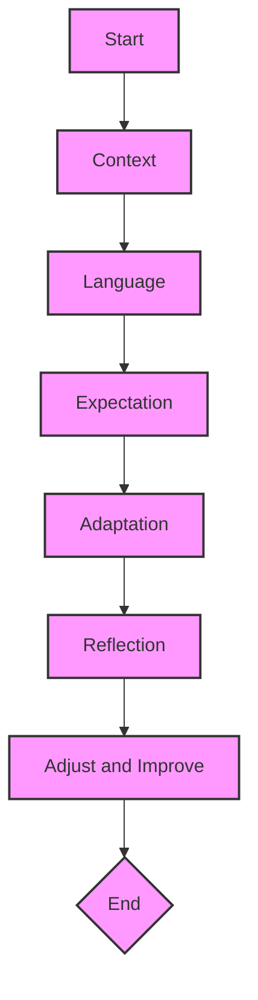

# CLEAR Framework for Prompt Engineering

The CLEAR framework is designed to enhance communication with AI models through effective prompt crafting. It stands for Context, Language, Expectation, Adaptation, and Reflection. Here's how to apply each component when designing your prompts.

## 1. Context

- **What It Means**: Set the stage for the AI by providing necessary background information.
- **How to Apply It**: Begin your prompt with relevant context to the task. For analytical tasks, include brief background information. For creative tasks, outline the desired theme or mood.

### Example:
"Given the recent trends in renewable energy, analyze the potential impact of solar power adoption on global energy markets."

## 2. Language

- **What It Means**: Utilize clear, precise, and straightforward language.
- **How to Apply It**: Choose words carefully, avoiding unnecessary jargon. Ensure your request is direct and easily understandable.

### Example:
"Write a summary of the key benefits of adopting renewable energy sources, focusing on solar and wind power, for a general audience."

## 3. Expectation

- **What It Means**: Clearly articulate the desired outcome, format, or specific details of the response.
- **How to Apply It**: Specify the response you're looking for, whether it's a list, detailed analysis, or any other format.

### Example:
"Provide a list of the top five benefits of solar power, including environmental, economic, and social aspects, in bullet points."

## 4. Adaptation

- **What It Means**: Tailor your prompt to the AI model's strengths and limitations.
- **How to Apply It**: Frame your prompt to leverage the model's capabilities. If aware of limitations, avoid tasks beyond the model's reach.

### Example:
"For models known for detailed analysis: 'Analyze recent data on solar power adoption and predict trends for the next decade.'"

## 5. Reflection

- **What It Means**: Use the responses to refine and improve future prompts.
- **How to Apply It**: Consider what worked and what didn't in the responses to adjust your approach for future prompts.

### Example:
Reflecting on an AI-generated analysis, you might adjust to include more specific data points or ask for comparisons for more insightful responses.

## Putting It All Together

When crafting a prompt, use all elements of the CLEAR framework:

"Given the growing importance of renewable energy sources in combating climate change, provide a detailed analysis of how solar power adoption has changed over the past decade and its potential impact on global energy markets over the next ten years. Use clear, accessible language suitable for a report to be presented at an international environmental conference. Expectations include data trends, economic impact, and environmental benefits. Tailor your analysis to emphasize factual information and data-driven insights. Reflect on the quality of the AI-generated response to improve the specificity and clarity of future prompts."

